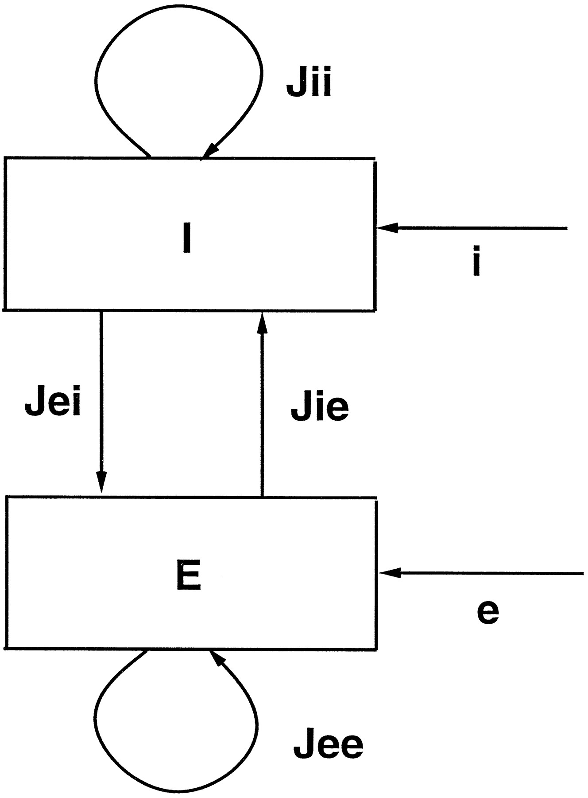

## The inhibition stabilized regime
Inhibition stabilized networks (ISNs) are looking like an increasingly successful framework for thinking about how recurrent circuits in the neocortex operate. The idea was originally proposed [20+ years ago](https://www.jneurosci.org/content/17/11/4382.full), but has really taken off in the past couple of years as people have begun to explicitly test the predictions of the ISN model with optogenetic experiments. ISNs really captivated my thinking around the middle of grad school. At its heart, the ISN model is a relatively straightforward idea, but one that might help neuroscientists unravel the consistently muddled results that come out of manipulating cortical circuits. It's also a theory with a very conservative scope. It doesn't seek to explain behavior, or even cognition - only the dynamical properties of cortical networks. Consequently, it makes some very concrete, mechanistic predictions that are readily testable. 

## What is an inhibition-stabilized network?
In simple terms, a network is an ISN if: 
1) Its recurrent excitatory connections are strong enough that the network is unstable (i.e. will undergo runaway positive feedback) in the absence of inhibition
2) It has recurrent inhibition, and this inhibition is strong enough to keep the network stable. 

https://www.sciencedirect.com/science/article/pii/S0896627309002876
https://www.sciencedirect.com/science/article/pii/S0896627318300709
https://www.biorxiv.org/content/10.1101/656710v2
https://journals.plos.org/ploscompbiol/article?id=10.1371/journal.pcbi.1005576&rev=1
https://www.jneurosci.org/content/37/49/12050.full
https://arxiv.org/abs/1907.00816
https://cdn.elifesciences.org/articles/29742/elife-29742-v2.pdf
https://www.physiology.org/doi/full/10.1152/jn.00732.2015
https://www.sciencedirect.com/science/article/pii/S0896627309001287
https://www.sciencedirect.com/science/article/abs/pii/S0306452217305316
https://arxiv.org/pdf/1907.00816.pdf
ssn
https://www.mitpressjournals.org/doi/10.1162/NECO_a_00472
https://www.sciencedirect.com/science/article/pii/S0896627314011350
## ISN models
More concretely, this can be understood by considering a simple dynamical model [(Tsodyks et al. 1997)](https://www.jneurosci.org/content/17/11/4382.full). The model is a recurrent network with two units: one to represent the population of excitatory neurons (_E_) and one to represent inhibitory neurons (_I_). 
 

The network is fully connected: _E_ connects to _I_ (_Jie_), _I_ connects to _E_ (_Jei_), and both units connect to themselves (_Jee_ and _Jii_). _E_ and _I_ can also receive external inputs, labeled _e_ and _i_.
The activity of the units evolves according to the [Wilson-Cowan differential equations](https://www.cell.com/biophysj/pdf/S0006-3495(72)86068-5.pdf):
 

Let's break these equations down a little bit, starting with the first one. The activity of _E_ evolves as a function of -_E_ + _ge_[_Jee E_  - _Jei I_ + _e(t)_]. _ge_ is a response function - in this case, it's just a rectified linear function. The inputs to _ge_ are simply the activity of all of the units in the network (there are only two: _I_ and _E_ itself) multiplied by the weights of the connections from these units onto _E_ plus the external input, _e(t)_. So a pretty standard input-output function, plus the _-E_ term, which drives the activity of _E_ to decay back to 0 at a rate defined by tau. Another way to think about this - in the language of modern machine learning, the units are leaky versions of ReLUs. The second equation describes how the activity of _I_ evolves and is exactly the same, except with different weights of _J_. 

_E_ is unstable if the gain of the input from _E_ back onto itself is greater than 1. Assuming that the slope of _ge(x)_ = 1 for _x_ > 0, this is true when _Jee_ > 1. Assuming that this condition is met, determining whether or not the network is an ISN is a little more complicated. [Ozeki et al. 2009](https://www.sciencedirect.com/science/article/pii/S0896627309002876) rewrite the above model as matrix equations, which makes the analysis much easier. From their supplemental text:

This is easy to understand if you assume that the excitatory and inhibitory populations have the same time constant i.e. _k_ = 0

### to do: equation showing dr/dt = (1-J)r + i if k = 1

https://ars.els-cdn.com/content/image/1-s2.0-S0896627309002876-mmc1.pdf